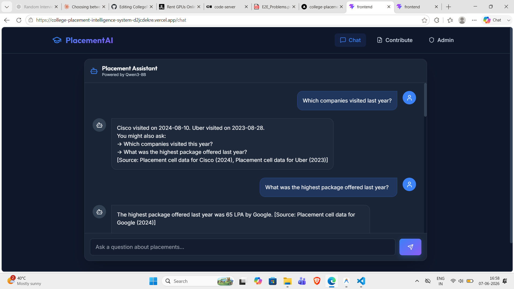

# College Placement Intelligence System

A RAG-based web application using langchain that serves as a private placement preparation assistant for college students. It uses local placement cell data and senior experiences to answer any placement-related questions. 


## Why I Built This
As a student navigating the placement season, I realized that generic internet advice doesn't apply to specific campus drives. Every college has its own patterns, eligibility criteria, and past trends. Apart from this I also felt the information gap where I had to constantly ask my seniors for all the small/irrelevant things too. I built this tool to centralize all that scattered data (PDFs regarding placement stats/policies and senior feedbacks) into one intelligent, queryable assistant so everyone in the college has the right access to the most crucial information just a query away!.

## How to Run It

> [!IMPORTANT]
> **For Evaluators:** The backend of this application requires a GPU to run the local Qwen3-8B LLM. To conserve JarvisLabs credits, the live backend instance may be paused. 
> 
> **To test the live deployed version:** Please email me at `itsadityasahu1509@gmail.com` and I will spin up the GPU instance immediately and share with you the live frontend URL (because I am using ngrok and everytime I start my instance again, a new backend URL is generated, which I have to paste in my environment variable and redeploy)
> Alternatively, you can run it locally on your own machine following the steps below.

### Prerequisites
- Python 3.9+
- Node.js 18+
- Ollama installed locally

### Step 1: Start Ollama
Ensure Ollama is running the `qwen3:8b` model locally.
```bash
ollama run qwen3:8b
```

### Step 2: Start the Backend
Open a terminal in the `backend` directory.
```bash
cd backend
python -m venv venv
# Windows: venv\Scripts\activate | Mac/Linux: source venv/bin/activate
pip install -r requirements.txt
uvicorn main:app --reload --port 8000
```
*Note: On the first run, the system will automatically ingest sample data into ChromaDB.*

### Step 3: Start the Frontend
Open another terminal in the `frontend` directory.
```bash
cd frontend
npm install
npm run dev
Navigate to `http://localhost:5173` in your browser.
```

## Architecture Decisions
- Local LLM (Qwen3-8B via Ollama): Ensures 100% data privacy. College placement data never leaves the server, eliminating data leakage risks and API costs.
  I could have used huggingface apis but the output quality of the free models are not that good and also the inference Api increases some latency.
- No Public Data: The system exclusively uses verified internal placement cell documents and consented senior experiences. This prioritizes specificity and accuracy over generic web advice. 
- RAG over Fine-tuning: Allows for continuous, dynamic updates (like new senior form submissions or new PDF uploads) without the immense cost and time of retraining the model.

## Tech Stack 
React (Frontend)
Python + fastAPI(backend)
langchain(for implementing rag and AI workflows)

## AI Usage
AI was extensively used during the development of this project. Specifically, an AI agent assisted in prototyping the modern React/Tailwind frontend.  AI was instrumental in ensuring best practices for both the  UI design. AI also helped me figure out and fix the bugs quickly improving my efficienncy and reducing the time for development.
One instance where I overridded the AI decision was to fix the n_documents from 20 to 5 ( because fetching more relevant document is time costly and the output would take minutes for even a simple query hampering user experience, So it was a tradeoff between choosing a high number and a low number, Keeping the number too high increases the output time and keeping the number too less does not provides AI enough context to give grounded answers, So I tested multiple values of n_documents and found 5 perfect for the usecase)

## What I did 

I architected the RAG pipeline, designed the prompt templates of langchain and its other components for better output quality, designed FastAPI endpoints.


## Future Plans (With 4 More Weeks)
- Multi-college Support: Scale the database architecture to partition data by college domains.
- Resume Upload: Add a feature where students can upload their resumes to get personalized company shortlists based on past selection trends.
- Analytics Dashboard: Build an advanced dashboard for the placement cell to track student readiness and common queries.

